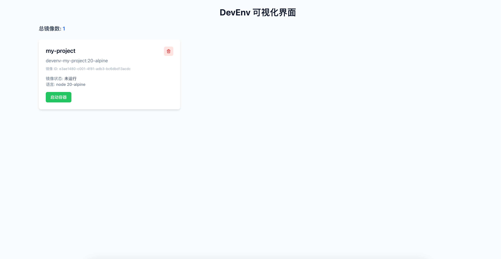

# DevEnv - 开发环境管理工具

DevEnv 是一个功能强大的 Node.js 命令行工具，旨在通过简单的 YAML 配置文件定义和管理项目开发环境。它能够一键构建和启动包含所有依赖的 Docker 容器，为开发者提供完全隔离、一致且可重现的开发环境，实现真正的开箱即用开发体验。

## 项目介绍

DevEnv 解决了开发环境配置的痛点，通过标准化的配置文件和自动化的容器管理，确保团队成员在不同机器上能够获得完全一致的开发环境，消除了"在我机器上可以运行"的问题。它支持多种编程语言环境，提供了命令行和浏览器可视化界面两种操作方式，满足不同开发者的使用习惯。

## 能力实现

DevEnv 通过以下核心能力实现开发环境的标准化和自动化管理：

1. **配置管理**：通过 YAML 配置文件定义环境参数，支持版本控制，确保环境配置的一致性和可追溯性。
2. **容器编排**：基于 Docker 技术，自动构建和管理容器，实现环境的隔离和标准化。
3. **多语言支持**：内置对 Node.js、Python、Java、Go、Rust、PHP、Ruby 等多种编程语言环境的支持，自动配置相应的基础镜像和依赖管理工具。
4. **端口映射**：灵活的端口映射配置，支持多个端口的映射，满足不同服务的网络需求。
5. **卷挂载**：支持主机与容器之间的目录挂载，实现代码的实时同步和持久化存储。
6. **环境变量管理**：在配置文件中定义环境变量，自动注入到容器中，简化配置管理。
7. **包管理**：支持在容器中自动安装额外的系统包，满足项目的特殊依赖需求。
8. **状态监控**：实时监控容器状态，提供详细的状态信息和操作日志。
9. **交互式终端**：提供进入容器的交互式终端，方便开发者在容器环境中进行操作。
10. **可视化界面**：内置浏览器可视化界面，提供直观的环境管理操作，适合不熟悉命令行的开发者。

## 功能特性

- ✅ 简单的 YAML 配置文件
- ✅ 支持多种编程语言环境（Node.js、Python、Java 等）
- ✅ 一键构建和启动开发环境
- ✅ 交互式容器终端
- ✅ 浏览器可视化界面
- ✅ 实时容器状态监控
- ✅ 一键启动/停止容器
- ✅ 美观的命令行界面

## 安装

### 前提条件

- Node.js >= 16
- Docker 已安装并运行
- pnpm 包管理器

### 安装步骤

1. **克隆项目**
   ```bash
   git clone <repository-url>
   cd devEnv
   ```
2. **安装依赖**
   ```bash
   pnpm install
   ```
3. **构建项目**
   ```bash
   pnpm build
   ```
4. **链接命令**
   ```bash
   npm link
   ```

现在你可以在任何地方使用 `devenv` 命令了。

## 使用方式

### 1. 初始化配置

在项目根目录执行：

```bash
devenv init
```

这会生成一个 `devenv.yaml` 配置文件，你可以根据项目需求修改它。

**示例：初始化特定语言环境**

```bash
# 初始化 Node.js 环境
devenv init --language node --version 18

# 初始化 Python 环境
devenv init --language python --version 3.9
```

### 2. 构建镜像

```bash
devenv build
```

根据配置文件构建 Docker 镜像。如果需要强制重新构建，可以使用 `--force` 参数：

```bash
devenv build --force
```

### 3. 启动环境

```bash
devenv up
```

启动开发环境容器。如果需要在启动前自动构建镜像，可以使用 `--build` 参数：

```bash
devenv up --build
```

### 4. 进入容器

```bash
devenv exec
```

进入容器的交互式终端。你也可以直接在容器中执行命令：

```bash
devenv exec ls -la
devenv exec npm install
```

### 5. 停止环境

```bash
devenv down
```

停止并删除容器。如果需要同时删除挂载的卷，可以使用 `--volumes` 参数：

```bash
devenv down --volumes
```

### 6. 查看状态

```bash
devenv status
```

查看容器状态，包括运行状态、端口映射等信息。

### 7. 删除镜像

```bash
devenv remove <image-id>
```

删除指定的镜像。你可以通过 `docker images` 命令查看镜像 ID。

### 8. 启动浏览器可视化界面

```bash
devenv web
```

启动浏览器可视化界面，访问 <http://localhost:3001> 查看和管理你的开发环境。

### 9. 查看帮助

```bash
devenv help
```

查看所有可用命令和参数说明。

### 完整使用流程示例

```bash
# 1. 初始化项目
devenv init

# 2. 编辑配置文件（根据项目需求修改）
# 例如：vim devenv.yaml

# 3. 构建镜像
devenv build

# 4. 启动环境
devenv up

# 5. 在容器中执行命令
devenv exec npm install
devenv exec npm run dev

# 6. 查看状态
devenv status

# 7. 停止环境
devenv down
```

## 配置文件说明

### devenv.yaml 完整配置示例

```yaml
# 项目基本信息
name: my-project

# 开发语言配置
language:
  name: node # 语言名称 (node, python, java, go, rust, php, ruby)
  version: 18 # 语言版本
  packageManager: npm # 包管理器 (npm, yarn, pnpm, pip, maven, gradle, go mod, cargo, composer, bundler)

# 端口映射配置
ports:
  - 3000:3000 # 主机端口:容器端口
  - 8080 # 仅指定容器端口，主机使用相同端口

# 卷挂载配置
volumes:
  - host: ./src # 主机路径
    container: /app/src # 容器路径
    mode: rw # 挂载模式 (rw, ro)
  - host: ./data
    container: /app/data
    mode: rw

# 环境变量配置
env:
  NODE_ENV: development
  API_KEY: your-api-key
  DEBUG: true

# 额外安装的系统包
packages:
  - git
  - curl
  - wget
  - build-essential

# 工作目录配置
workspace: /app

# 启动命令配置
startCommand: npm run dev

# 构建命令配置
buildCommand: npm run build

# 网络配置
network:
  name: my-project-network
  driver: bridge

# 容器配置
container:
  name: my-project-container
  restart: no
  tty: true
  stdin_open: true
```

### 配置项详细说明

#### 1. 基本配置

- **name** <span style="color: red;">(必填)</span>: 项目名称，用于标识环境和容器
- **workspace** <span style="color: green;">(可选)</span>: 容器内的工作目录，默认值为 `/workspace`

#### 2. 语言配置

- **language.name** <span style="color: red;">(必填)</span>: 语言名称，支持以下值：
  - `node`: Node.js 环境
  - `python`: Python 环境
  - `java`: Java 环境
  - `go`: Go 环境
  - `rust`: Rust 环境
  - `php`: PHP 环境
  - `ruby`: Ruby 环境
- **language.version** <span style="color: red;">(必填)</span>: 语言版本，如 `18` (Node.js)、`3.9` (Python) 等
  - 版本最好使用 Alpine, 体积小
- **language.packageManager** <span style="color: green;">(可选)</span>: 包管理器，根据语言自动选择默认值，也可手动指定
  - Node.js: `npm`
  - Python: `pip`
  - Java: `maven`
  - Go: `go mod`
  - Rust: `cargo`
  - PHP: `composer`
  - Ruby: `bundler`

#### 3. 端口映射

- **ports** <span style="color: green;">(可选)</span>: 端口映射列表，支持两种格式：
  - 仅指定容器端口：如 `- 3000`，主机将使用相同端口
  - 主机端口:容器端口：如 `- 3000:3000`，指定具体的映射关系
  - 默认值：无

#### 4. 卷挂载

- **volumes** <span style="color: green;">(可选)</span>: 卷挂载配置列表，每个挂载项包含：
  - **host** <span style="color: red;">(必填)</span>: 主机路径，支持相对路径和绝对路径
  - **container** <span style="color: red;">(必填)</span>: 容器内路径
  - **mode** <span style="color: green;">(可选)</span>: 挂载模式，可选值：
    - `rw`: 读写模式（默认）
    - `ro`: 只读模式
  - 默认值：无

#### 5. 环境变量

- **env** <span style="color: green;">(可选)</span>: 环境变量键值对，会自动注入到容器中
  - 默认值：无

#### 6. 系统包

- **packages** <span style="color: green;">(可选)</span>: 需要在容器中安装的额外系统包列表
  - 默认值：无

#### 7. 命令配置

- **startCommand** <span style="color: green;">(可选)</span>: 容器启动后执行的命令
  - 默认值：无
- **buildCommand** <span style="color: green;">(可选)</span>: 构建项目时执行的命令
  - 默认值：无

#### 8. 网络配置

- **network.name** <span style="color: green;">(可选)</span>: 网络名称，默认使用项目名称
- **network.driver** <span style="color: green;">(可选)</span>: 网络驱动，默认值为 `bridge`

#### 9. 容器配置

- **container.name** <span style="color: green;">(可选)</span>: 容器名称，默认使用项目名称
- **container.restart** <span style="color: green;">(可选)</span>: 重启策略，可选值：
  - `no`: 不自动重启（默认）
  - `always`: 总是自动重启
  - `on-failure`: 失败时自动重启
  - `unless-stopped`: 除非手动停止，否则自动重启
- **container.tty** <span style="color: green;">(可选)</span>: 是否分配伪终端，默认值为 `true`
- **container.stdin_open** <span style="color: green;">(可选)</span>: 是否保持标准输入打开，默认值为 `true`

## 浏览器可视化界面

### 启动界面

```bash
devenv web
```

服务器会在 <http://localhost:3001> 启动。

### 界面功能

1. **状态概览**
   - 总镜像数
   - 运行中容器数
   - 最近构建时间
2. **镜像列表**
   - 项目名称
   - 语言版本
   - 创建时间
   - 容器状态
3. **操作按钮**
   - **启动**: 启动容器
   - **停止**: 停止容器
   - **进入容器**: 进入容器终端
4. **状态指示器**
   - 绿色圆点: 运行中
   - 灰色圆点: 已停止

### 界面截图



## 实际使用场景

### 场景 1: Node.js 项目

**配置文件示例**:

```yaml
name: node-project
language:
  name: node
  version: 18
  packageManager: pnpm
ports:
  - 3000:3000
volumes:
  - host: ./src
    container: /app/src
  - host: ./package.json
    container: /app/package.json
  - host: ./pnpm-lock.yaml
    container: /app/pnpm-lock.yaml
env:
  NODE_ENV: development
  VITE_API_URL: http://localhost:8080
packages:
  - git
  - curl
workspace: /app
startCommand: pnpm dev
buildCommand: pnpm build
```

**使用流程**:

```bash
# 初始化配置
devenv init --language node --version 18

# 编辑配置文件（添加上述内容）

# 构建镜像
devenv build

# 启动环境
devenv up

# 安装依赖
devenv exec pnpm install

# 启动开发服务器
devenv exec pnpm dev

# 访问应用
# 浏览器打开 http://localhost:3000
```

### 场景 2: Python 项目

**配置文件示例**:

```yaml
name: python-project
language:
  name: python
  version: 3.9
  packageManager: pip
ports:
  - 8000:8000
volumes:
  - host: ./app
    container: /app/app
  - host: ./requirements.txt
    container: /app/requirements.txt
env:
  FLASK_ENV: development
  DATABASE_URL: sqlite:///dev.db
packages:
  - git
  - curl
  - build-essential
workspace: /app
startCommand: python -m flask run --host=0.0.0.0
```

**使用流程**:

```bash
# 初始化配置
devenv init --language python --version 3.9

# 编辑配置文件（添加上述内容）

# 构建镜像
devenv build

# 启动环境
devenv up

# 安装依赖
devenv exec pip install -r requirements.txt

# 启动开发服务器
devenv exec python -m flask run --host=0.0.0.0

# 访问应用
# 浏览器打开 http://localhost:8000
```

## 常见问题

### 1. 构建镜像时出现 "apt-get: not found" 错误

**原因**: Alpine 镜像使用 apk 而不是 apt
**解决**: 系统会自动检测包管理器并使用正确的命令

### 2. 进入容器时出现 "OCI runtime exec failed" 错误

**原因**: 容器中没有 bash
**解决**: 系统会自动尝试 bash → sh → ash → dash 的 fallback 机制

### 3. 浏览器界面无法访问

**检查**:

- Docker 是否运行
- 端口 3001 是否被占用
- 防火墙设置

### 4. 容器启动失败

**检查**:

- 端口是否被占用
- 镜像是否存在
- Docker 权限是否正确

## 技术架构

- **前端**: React + Vite + Tailwind CSS
- **后端**: Node.js 内置 http 模块
- **Docker 集成**: dockerode
- **存储**: 本地 JSON 文件
- **命令行**: Commander.js

## 命令参考

| 命令   | 参数             | 说明                 |
| ------ | ---------------- | -------------------- |
| init   | \[path]          | 初始化配置文件       |
| build  | \[-f, --force]   | 构建 Docker 镜像     |
| up     | \[-b, --build]   | 启动开发环境         |
| exec   | \[command...]    | 执行命令或进入容器   |
| down   | \[-v, --volumes] | 停止并删除容器       |
| status | -                | 查看容器状态         |
| remove | \[id]            | 删除镜像             |
| web    | -                | 启动浏览器可视化界面 |

## 贡献

欢迎提交 Issue 和 Pull Request！

## 许可证

MIT License
